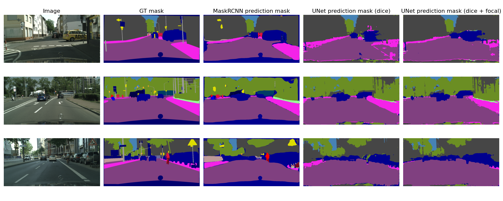
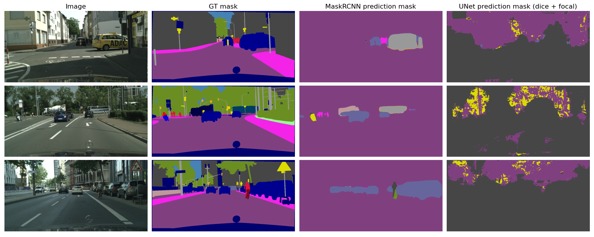
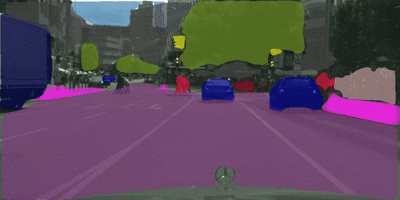
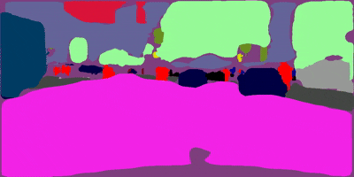

# Semantic segmenation on Cityscapes dataset
## Timeline
- `(03/10/2025)` Add code and notebooks
- `(07/10/2025)` Add a report
- `(15/10/2025)` Try to train Mask R-CNN to achieve better mAP
- `(11/2025)` Train and validate DeepLabv3 model
- `(12/2025)` Try SAM
- `(01/2026)` Expand to instance segmentation

## Introduction
A small project aims to create an end-to-end pipeline semantic segmentation on Cityscapes dataset from scratch. The pipeline includes processing datasets, training models, validating performance and visualizing as videos.

## Evaluation results
Note: 
- `Full` means the model considers all the training classes in the dataset, while in `pedveh` type, the model only considers the person and vehicles in the dataset (trainId 11 to 18).
- Mask R-CNN models were trained 5 epochs and U-Net models were trained only 3 epochs for Pedveh (loss value oscilliated heavily) and 4 epochs for Full.

### Quantity
| Model | Resolution | Type | mIoU | mAP@50 | mAP |
|-------|:----------:|:----:|:----:|:------:|:---:|
| Mask R-CNN | Half | Full | **0.8128** | 41.23 | 25.52 |
| Mask R-CNN | Half | Pedveh | 0.6902 | **50.93** | **29.3** |
| U-Net | Half | Full (w/o focal) | 0.221 | 4.71 | 1.63 |
| U-Net | Half | Full (with focal) | 0.219 | 5.08 | 1.88 |
| U-Net | Half | Pedveh | 0.082 | 0.73 | 0.14 |
### Quality
#### Full
Below is the quality comparison of Mask R-CNN and U-Net of full classes

#### Pedveh
Below is the quality comparison of Mask R-CNN and U-Net of pedveh only type


### Demo videos (to be improved) 



## Getting started with notebooks
- [segment-cts-full-maskrcnn.ipynb](notebooks/segment-cts-full-maskrcnn.ipynb): train and validate Mask R-CNN on full classes type.
- [segment-cts-pedveh-maskrcnn.ipynb](notebooks/segment-cts-pedveh-maskrcnn.ipynb): train and validate Mask R-CNN on pedveh classes type.
- [segment-cts-full-unet.ipynb](notebooks/segment-cts-full-unet.ipynb): train and validate U-Net on full classes type.
- [segment-cts-pedveh-unet.ipynb](notebooks/segment-cts-pedveh-unet.ipynb): train and validate U-Net on pedveh classes type.

## Usage
Download the dataset at [Cityscapes website](https://www.cityscapes-dataset.com/) and clone the [cityscapesScripts](https://github.com/mcordts/cityscapesScripts) to root directory.

To train a model, run the `train.py` using the following format: 
```
python ./train.py --model <model_name> --type <class_type> --ckpt_path <checkpoint path>
```
For example: to train a maskrcnn model with full classes and save checkpoint to "./checkpoints"
```
python ./train.py --model maskrcnn --type full --ckpt_path ./checkpoints
```

To validate a model, run the `valid.py` using the following format: 
```
python ./valid.py --model <model_name> --type <class_type> --ckpt_path <checkpoint path>
```
For example: to validate a maskrcnn model with full classes and load checkpoint from "./checkpoints/maskrcnn_5epoch_full.pth"
```
python ./valid.py --model maskrcnn --type full --ckpt_path "./checkpoints/maskrcnn_5epoch_full.pth"
```

## Specification (to be updated)
Model | Type | Resolution | lr sched | im / gpu | train mem (GB) | train time (s/iter) | total train time (hr) | inference total batch=4 (s/im) | inference model batch=4 (s/im) | inference model batch=1 (s/im) | mask AP 
-- | -- | -- | -- | -- | -- | -- | -- | -- | -- | -- | -- |
Mask R-CNN | Full | Half | xx | x | x.x | x.xxxx | xx.xx | x.xx | x.xx | x.xx | x.xx | x.xx | - | xxx |


## Citation
```
@inproceedings{Cordts2016Cityscapes,
    title={The Cityscapes Dataset for Semantic Urban Scene Understanding},
    author={Cordts, Marius and Omran, Mohamed and Ramos, Sebastian and Rehfeld, Timo and Enzweiler, Markus and Benenson, Rodrigo and Franke, Uwe and Roth, Stefan and Schiele, Bernt},
    booktitle={Proc. of the IEEE Conference on Computer Vision and Pattern Recognition (CVPR)},
    year={2016}
}
```
